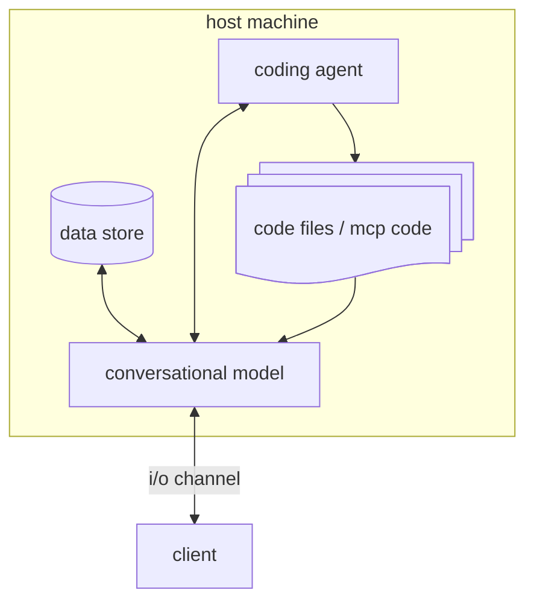

# Monkey Release

## Data store

An editable key value data store. The conversational agent can put and reterive notes here. This storage may be backed up by a file system or a database of whatever.

## Conversational Agent

This is the agent that will be interacting with the client. It's first and main tool will be the data store.

## Coding agent

This will be another agent that can be invoked by the conversational agent. It will have access to a file system where this agent will write/refactor code for local tools and MCP servers. These will be available to the conversational agent to use in some form.

## Some more nice to haves

* it would be nice if the conversational agent was non blocking. Like it should be able to trigger some action (data store io / mcp use / coding invocation) and immidiately resume conversation with the client

* There should be a nice visual way to monitor this cordination of all the actions going on during the run.
